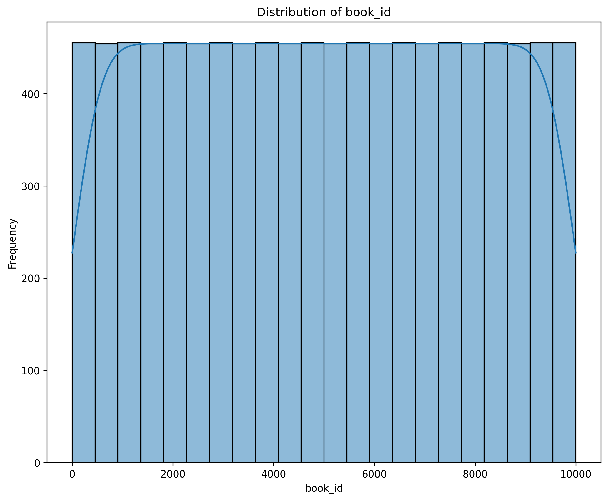
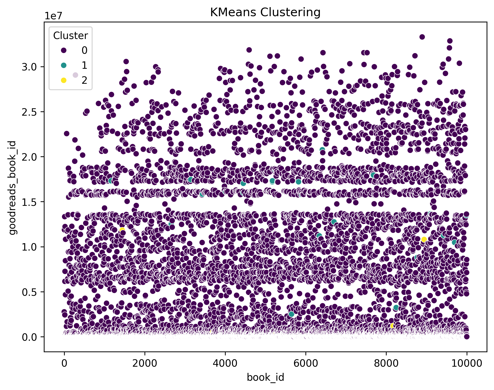
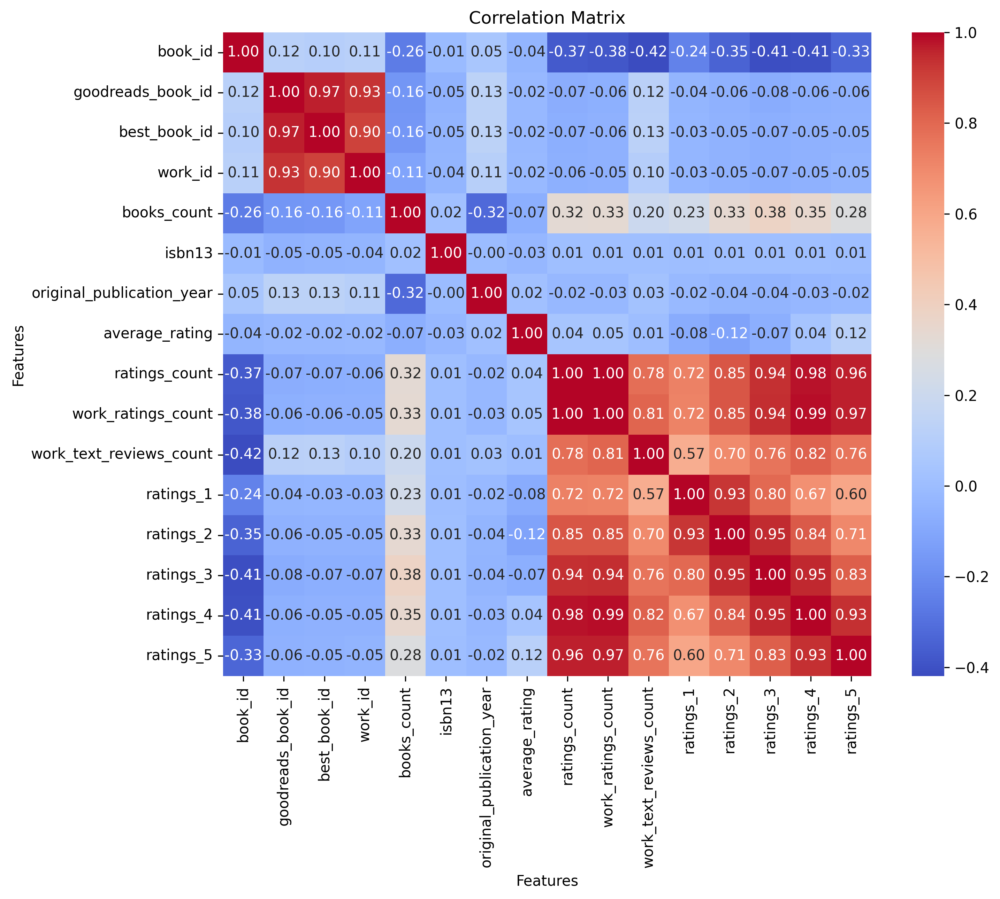
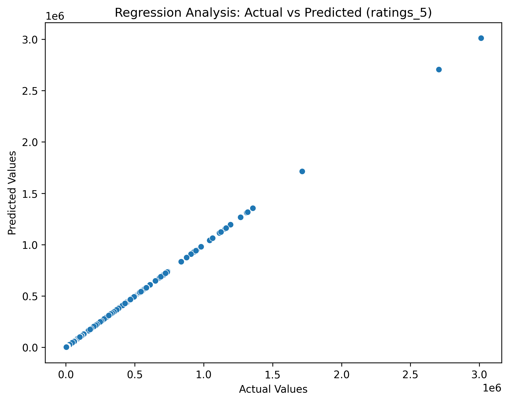
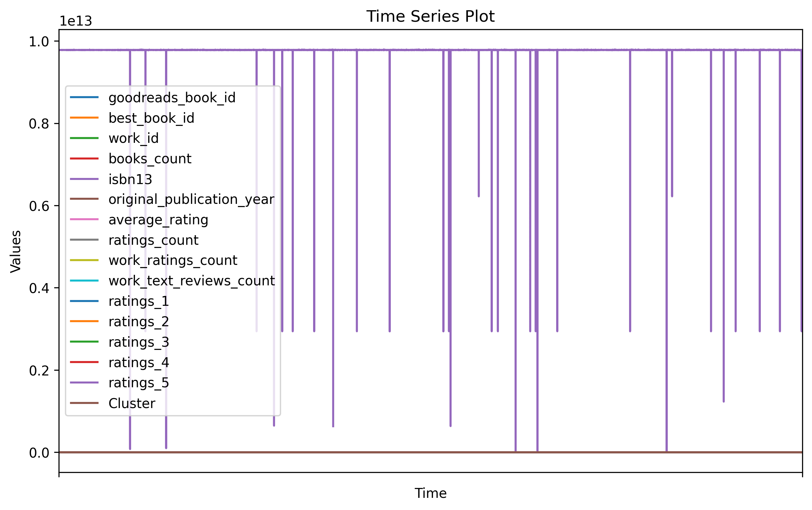

# Dataset Analysis for goodreads

### Story of the Goodreads Dataset

In the vast ocean of literary data, we have a compelling dataset that offers a view into the rich world of books on Goodreads, consisting of **10,000 entries** with **23 attributes** each. This dataset presents an array of information, from book titles and authors to ratings and publication years. Its structure provides a fertile ground for analysis.

#### Dataset Overview
The dataset includes columns such as:
- **book_id**: Unique identifier for each book.
- **title**: The complete title of the book, often including sequels and series information.
- **average_rating**: A float representing the average score given by readers.
- **ratings_count**: Total number of ratings received.

For example, book entries include popular titles like "The Hunger Games" and "Harry Potter and the Sorcerer's Stone", showcasing a diversity in genres and readership.

#### Summary Statistics
Here, we glean some insights into the distribution of the data:
- The **average rating** has a mean of approximately **4.00**, indicating a generally positive reception of the books.
- **Ratings count** shows a significant variance, with a maximum of over 4.7 million ratings, highlighting the engagement some books receive compared to others, while the median counts reflect more modest numbers.
- Notably, **books_count** (the number of books published by an author) has a wide range with a maximum of **3455**, suggesting prolific authors contribute significantly to the dataset.

#### Missing Values
In our dataset, we observe some missing values:
- The **isbn** and **original_title** fields have 700 and 585 missing values respectively, which could affect any textual analyses or ISBN-based searches.
- Other attributes like **language_code** and **original_publication_year** also exhibit missing entries but are generally less critical for broader analysis.

#### Correlation Insights
Exploring the relationships among variables unveils interesting patterns:
- A strong negative correlation between **ratings_count** and **average_rating** (-0.373), suggesting that highly rated books may not always receive a large number of ratings.
- Furthermore, the **work_ratings_count** has a remarkably high correlation with the **ratings_5** category (0.966), indicating that the number of reviews directly influences the number of excellent ratings.

*Accompanying visualization can include heatmaps displaying these correlations, providing a graphical representation of relationships.*

#### Outliers
Outliers have been identified across various categories:
- For instance, some books show high outlier counts in ratings, which could signal exceptional interest or promotional bursts.

#### K-Means Clustering
The dataset includes information on **k-means clustering**, with an inertia value of **2.16e+25**, indicating how well the data points are grouped into clusters. A lower inertia value suggests a better fit where data points within the same cluster are closer together.

#### Regression Analysis
A detailed regression analysis targeting **ratings_5** reveals that multiple factors influence ratings. The coefficient for **work_ratings_count** is 1, indicating a direct relationship. This suggests that books which attract more reviews are likely to garner a higher number of 5-star ratings.

#### Time Series
While the dataset spans a broad range of books, the **time series** analysis starts from the year 1970. The time column indicates a unique timestamp for each entry rather than a traditional illustration of trends over time.

### Conclusion
This dataset tells a rich story about readers' preferences, author performance, and how books resonate within the Goodreads community. Any further analysis can delve into potential publication trends over the years or examine reader demographics based on reviews and ratings. By interpreting these data models along with visualizations like histograms for rating distributions and line charts for trends, we can better understand the literary landscape as reflected through user interactions on Goodreads.

## Generated Visualizations

