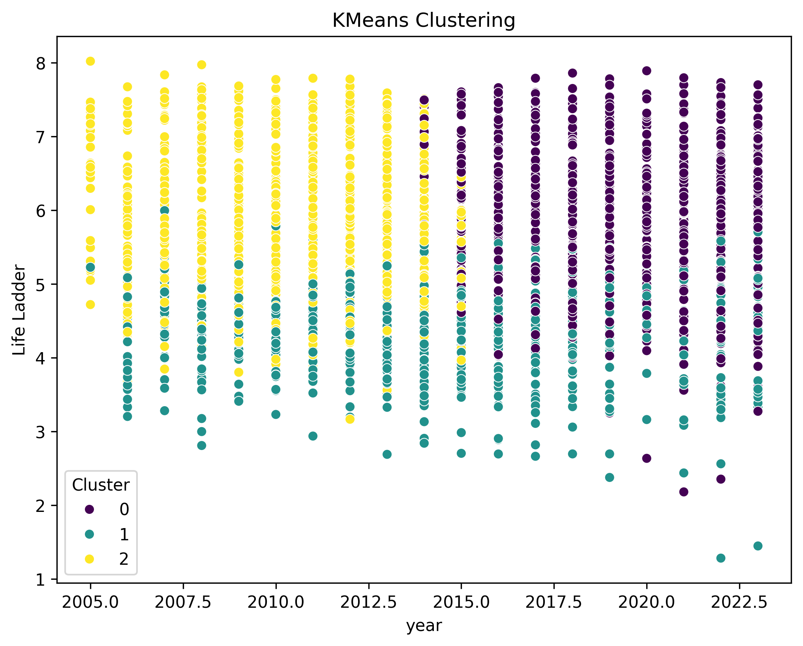
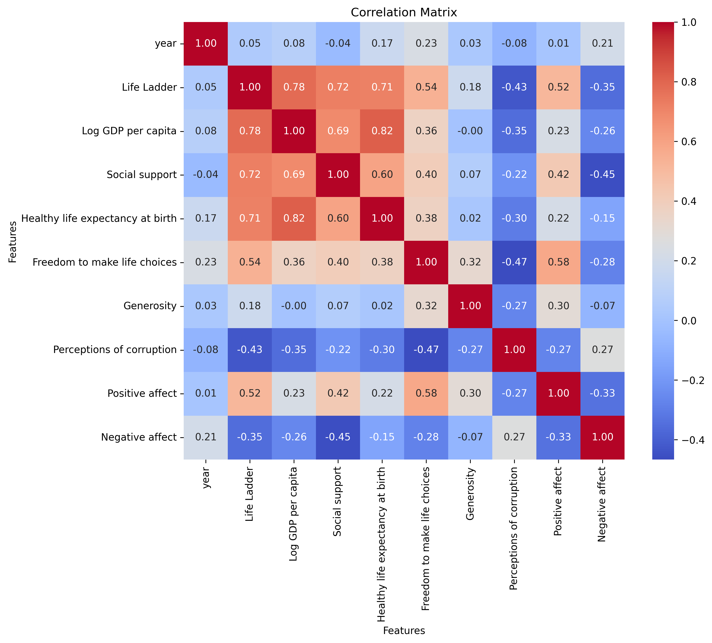
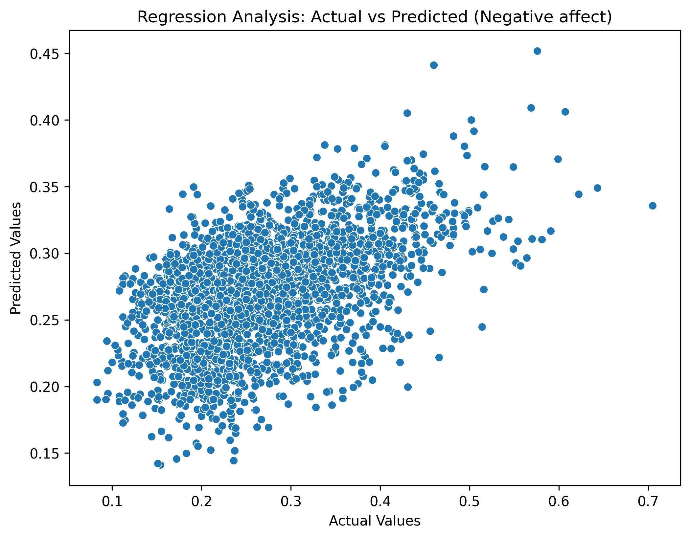
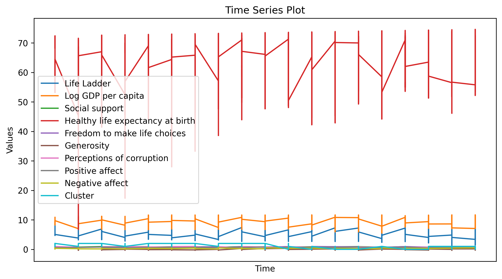
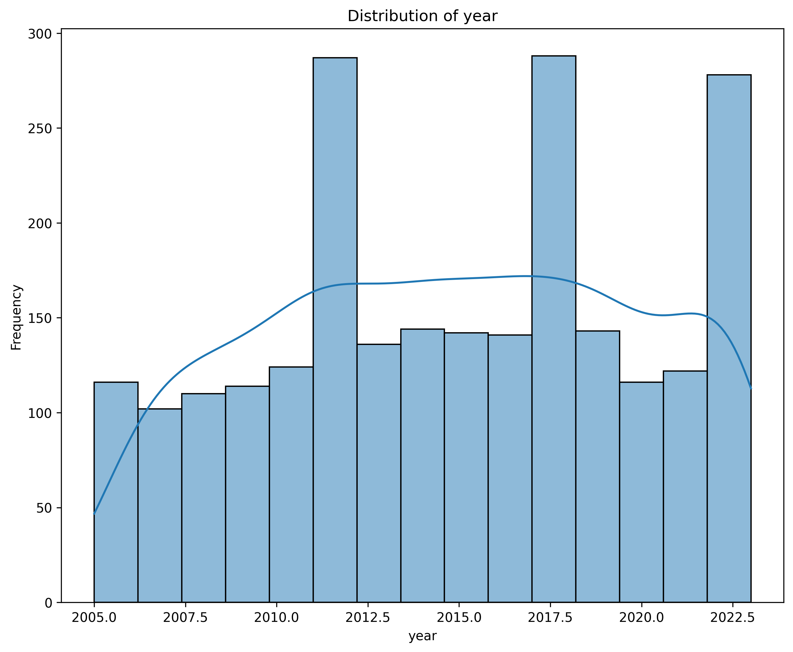

# Dataset Analysis for happiness

The analysis of the happiness dataset reveals a compelling story about the factors influencing happiness across various countries and years. The dataset consists of **2,363 rows and 11 columns**, providing a rich tapestry of information on happiness, economic metrics, and social indicators.

### Overview of Dataset
The dataset includes the following key columns:
- **Country name**: The name of the country.
- **Year**: The year of the data point.
- **Life Ladder**: A measure of perceived well-being or happiness.
- **Log GDP per capita**: The natural logarithm of GDP per capita, indicating economic status.
- **Social support**: The strength of social networks and community support.
- **Healthy life expectancy at birth**: The average number of years a newborn can expect to live in good health.
- **Freedom to make life choices**: A measure of personal freedom.
- **Generosity**: The willingness to give money to charitable organizations.
- **Perceptions of corruption**: The extent to which corruption is perceived in the government and business.
- **Positive affect**: A measure of positive experiences and emotions.
- **Negative affect**: A measure of negative experiences and emotions.

### Summary Statistics
The summary statistics illustrate the data distribution:
- The **mean Life Ladder score** is approximately **5.48**, indicating a moderate level of happiness across the dataset.
- The **mean Log GDP per capita** stands at about **9.40**, suggesting varying economic health across countries.
- Notably, there are some missing values in critical columns: **Log GDP per capita** has 28 missing values, while **Social support** and **Generosity** also show deficiencies in data.

### Correlation Insights
One of the fascinating aspects of the dataset is the **correlation matrix**, which reveals how different factors relate to the Life Ladder:
- **Log GDP per capita** shows a strong positive correlation (**0.78**) with the Life Ladder, indicating that wealthier nations tend to report higher happiness levels.
- **Social support** and **healthy life expectancy** also demonstrate notable positive correlations (**0.72 and 0.71**, respectively).
- In contrast, **perceptions of corruption** exhibit a significant negative correlation with happiness (**-0.43**), emphasizing the detrimental effect of corruption on societal well-being.

### Outlier Detection
In the dataset, there are **two outliers** identified in the **Life Ladder** scores. These outliers may represent countries with extreme values of happiness, either markedly high or low, suggesting a need for further examination into their unique circumstances.

### Clustering and Segmentation
The **k-means clustering** analysis yielded an inertia of about **63923.53**, hinting at a potential optimal segmentation of countries based on their happiness and accompanying metrics. This might facilitate targeted strategies for improving happiness in distinct country clusters.

### Regression Analysis
The regression analysis aimed at predicting **negative affect** reveals interesting coefficients:
- **Social support** has a significant negative impact on negative emotions (**-0.12**), while **freedom to make life choices** also negatively influences negative affect.
- The model's intercept is approximately **-7.55**, suggesting that the baseline negative affect level in absence of other predictors is considerably low.

### Time Series Exploration
The dataset spans several years, from **1970 to 2023**, allowing for an intriguing **time series analysis** to observe fluctuations in happiness and its contributing factors over time.

### Visualizations
Further insights are vividly presented in accompanying visualizations which chart the relationships between happiness indicators, time trends for specific countries, and geographical distribution of happiness across the globe. These visualizations will help contextualize the numerical findings and enhance the understanding of the factors influencing happiness.

### Conclusion
In summary, this dataset presents a multifaceted look at happiness across the globe. Key indicators such as economic performance, social support, and perceived corruption play significant roles in shaping the happiness of nations. Future efforts to improve happiness could benefit from focusing on economic as well as social factors, particularly in countries where these dimensions are lacking. Overall, this analysis lays a rich groundwork for deeper inquiries into the evolving dynamics of global happiness.

## Generated Visualizations

