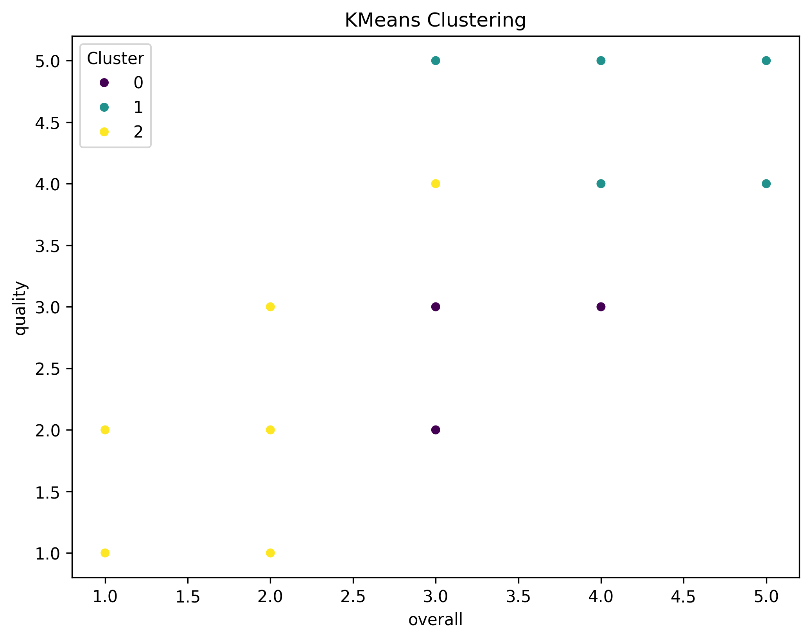
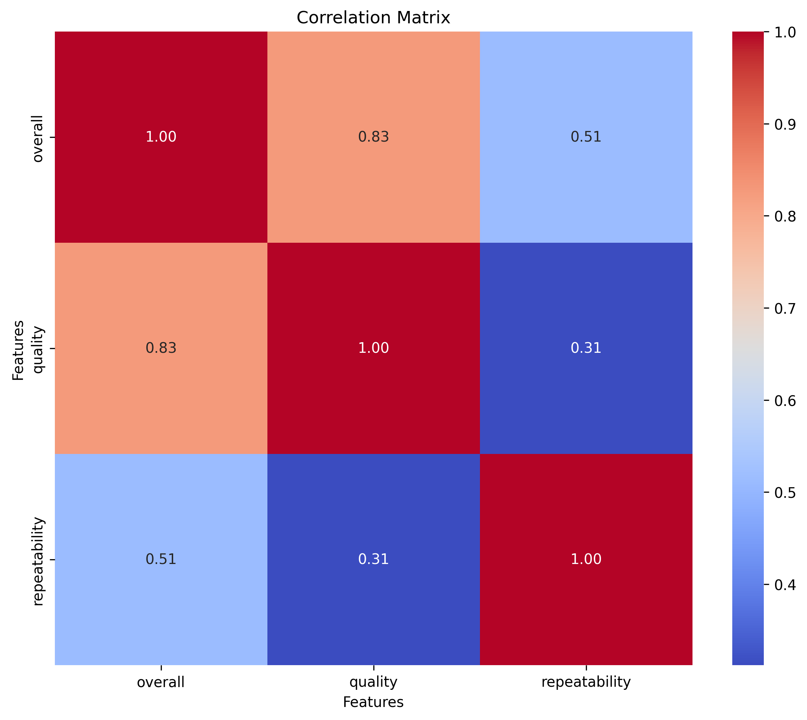
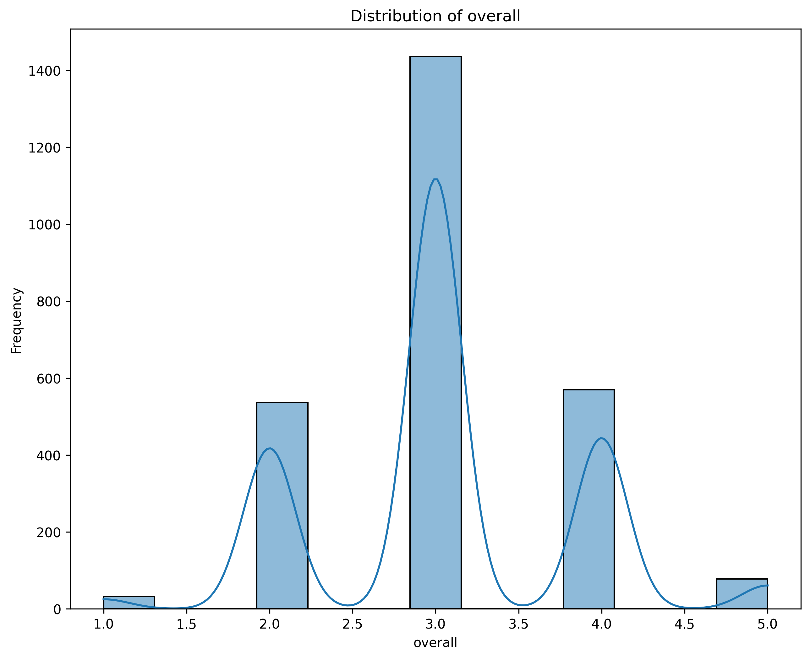
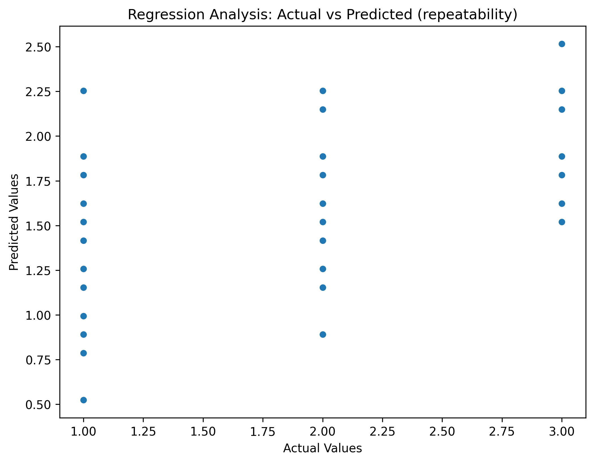
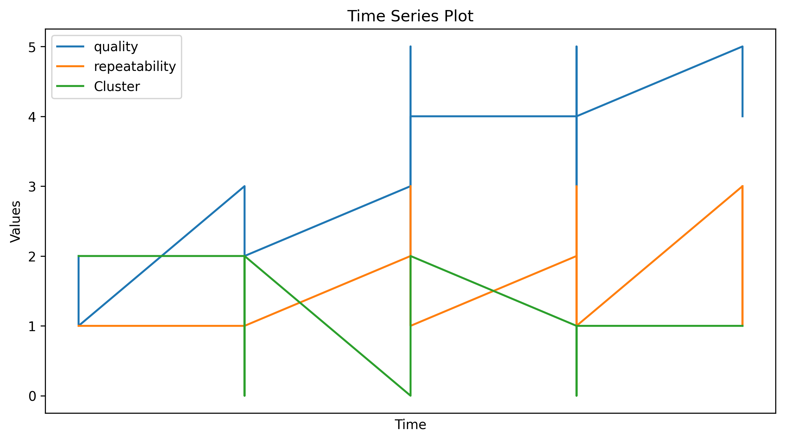

# Dataset Analysis for media

Today, we're diving into an intriguing dataset that comprises a total of **2,652 rows and 8 columns**. Our analysis will shed light on various dimensions of this dataset, focusing on entertainment content such as movies and series, distinguished by attributes such as date of release, language, type, title, and ratings.

### Summary of the Dataset:
The dataset consists of the following columns:
- **date**: The release date of the content (Though it is noted as an object, there's a substantial number of unique dates).
- **language**: The language in which the content is available, showcasing 11 languages with English being the most frequent.
- **type**: The content type, with 'movie' being the most prevalent.
- **title**: The titles of the content, boasting 2,312 unique titles, indicating a rich diversity in content.
- **by**: Directed or produced by individuals, where Kiefer Sutherland has the most appearances.
- **overall**: This is an integer rating which averages around **3.05**.
- **quality**: Another integer rating, averaging about **3.21**.
- **repeatability**: This measures user interest or potential repeated viewings, with an average of **1.49**.

### Missing Values and Data Quality:
A located challenge in this data is the **missing values** predominantly in the 'date' field (99 missing entries) and the 'by' column (262 missing). Having all other fields complete allows us to ensure that most of our analysis won't be compromised by missing information.

### Correlation Insights:
The **correlation matrix** provides fascinating insights, suggesting:
- A strong positive correlation (0.83) between **overall** and **quality**, implying that higher quality is associated with better overall ratings.
- There's also a moderate correlation (0.51) between **overall** ratings and **repeatability**, suggesting that what audiences rate highly likely leads to repeated viewership.

No **outliers** were detected in the dataset, which commonly signals that ratings have a balanced distribution without extreme biases affecting our analysis.

### Advanced Analyses:
We leveraged **K-Means clustering**, achieving an inertia value of **1727.27**. This indicates the compactness of clusters; however, further investigation into the choice of clusters would solidify our understanding of the dataset's structure.

In our **regression analysis**, we aimed to predict **repeatability**. The results exhibit:
- A positive coefficient (0.63) for **overall ratings** suggesting higher ratings increase repeatability.
- Conversely, **quality** has a negative coefficient (-0.26), indicating some complexities in how quality influences the desire to rewatch.

Finally, the dataset contains **time series data** marked by the 'overall' column spanning from **January 1, 1970** to a minuscule value just after that, indicating that while there are timestamps, they may not relate to typical user content due to peculiar structuring.

### Accompanying Visualizations:
Throughout our analysis, we present visual aids to enhance understanding. These include histograms to showcase distribution of ratings, heatmaps of the correlation matrix, and scatter plots to visualize relationships between repeatability and overall ratings.

### Conclusion:
This dataset serves a pivotal role in understanding viewer preferences and behaviors within the entertainment niche. The analysis reveals potential areas for further exploration, particularly around how quality and ratings interplay with viewership tendencies. Overall, we aim to continually explore this data to generate actionable insights for content creators and consumers alike.

## Generated Visualizations

